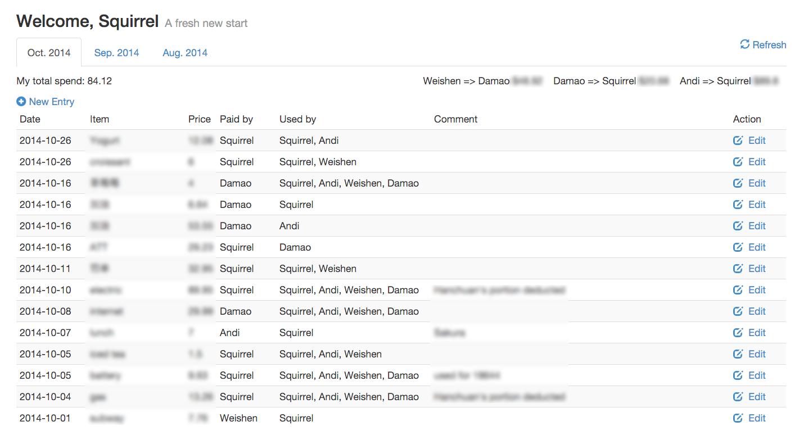

#billShare - Bill share system for roommates#

Yes, this is an one-page app. What you see in this screenshot is what you will have with it.

##How to deploy##
1. You need a PHP+MySQL web environment.
2. Import README/structure.sql to an mysql database.
3. Move README/config.php.example to include/config.php, modify its content by your need.
4. Insert user informations into user table.

    INSERT INTO  `DATABASE`.`users` (`id` ,`name` ,`password`) VALUES (NULL ,  `USER_NAME`, MD5(`MD5(PASS_WORD).$pagetitle`));
  
    You need to replace `DATABASE`, `USER_NAME` and entire `MD5(PASS_WORD).$pagetitle`(this is PHP syntax) to actual valid strings. If you don't want password protection, leave password field to `None`.
5. (Optional) Set http rewrite, this is only available when you don't have someone's password field set. Also block include/ access.

NGINX Example:

    server {
      listen 80;
      server_name your.domain;
      access_log /var/log/nginx/your.domain.access.log;
      error_log /var/log/nginx/your.domain.error.log;

      root /path/to/this/app;
      index index.php;
      try_files $uri $uri/ /index.php?$uri;
      location ^~ /include/ {
        deny all;
      }
      location ~ \.php$ {
        try_files $uri =404;
        fastcgi_split_path_info ^(.+\.php)(/.+)$;
        fastcgi_pass unix:/var/run/php5-fpm.sock;
        fastcgi_index index.php;
        include fastcgi_params;
      }
    }

##How to use##
Open the website you've deployed, you'll be prompted to enter the username and password (if necessary). Once you've logged in everything in the page is pretty straightforward.

If you have the http rewrite set, visit http://your.domain/username will also lead to the same page.

##Need your help##
I wish I could add more features to it to make it not looks like a toy, but I don't have spare time for it. I really hope someone can send a pull request regarding:

* Payment email confirmation
* Admin page
* Bill share entity creation and management
* Any great ideas

Thanks!
